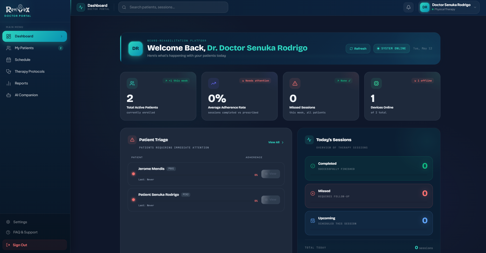
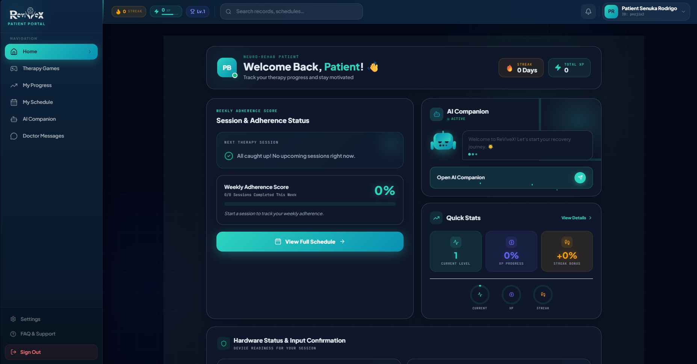

# ReViveX 🧠

> A neuro-rehabilitation platform helping patients recover from Parkinson's and stroke-related disabilities through guided therapy sessions, real-time progress tracking, and AI-assisted insights.

 **Live Demo:** [revivex-frontend-prod.vercel.app](https://revivex-frontend-prod.vercel.app)

---

## Overview

ReViveX connects therapists, patients, and caregivers in a unified platform designed for neuro-rehabilitation. Patients perform prescribed therapy exercises (targeted at conditions like Parkinson's disease and post-stroke disabilities), while therapists monitor adherence, track recovery metrics, and adjust treatment plans in real time.

Built by a team of 6 as a full stack collaborative project using modern web technologies.

---

## Screenshots

### Doctor Portal

*Real-time overview of patient adherence, missed sessions, and triage alerts*

### Patient Portal

*Session tracking, weekly adherence score, XP progress, and AI Companion*

---

## Features

### Therapist Portal
- Dashboard overview of all active patients with adherence rates and triage alerts
- Real-time monitoring of patient performance and session completion
- Review and update individual rehabilitation exercise plans
- Schedule management and session tracking
- AI Companion for decision-making insights
- Export patient data (PDF/Excel) and view audit trails
- Receive reminders and notifications for at-risk patients

###  Patient Portal
- View and start assigned therapy sessions
- Weekly adherence score and streak tracking with XP gamification
- Progress dashboard with session history
- AI Companion for guided support during recovery
- Direct messaging with assigned therapist
- Hardware status monitoring for device-based input

###  Caregiver Support
- Receive reminders and notifications about patient sessions
- Message assigned therapist on behalf of patient

###  Admin Panel
- Manage system roles and permissions
- Add, edit, or remove therapists
- User registration and account management

---

## Tech Stack

| Layer | Technology |
|-------|-----------|
| Frontend | Next.js, React.js |
| Language | TypeScript, JavaScript |
| Styling | CSS, Tailwind CSS |
| Database | Firebase (Firestore) |
| Hosting | Vercel |
| Version Control | Git, GitHub |

---

## Getting Started

### Prerequisites
- Node.js >= 18.x
- npm or yarn

### Installation

```bash
git clone https://github.com/ReViveX-Team-Build/ReViveX-frontend.git
cd ReViveX-frontend
npm install
```

### Environment Setup

Create a `.env.local` file in the root directory:

```
NEXT_PUBLIC_FIREBASE_API_KEY=use_your_key_here
NEXT_PUBLIC_FIREBASE_AUTH_DOMAIN=use_your_key_here
NEXT_PUBLIC_FIREBASE_PROJECT_ID=use_your_key_here
NEXT_PUBLIC_FIREBASE_STORAGE_BUCKET=use_your_key_here
NEXT_PUBLIC_FIREBASE_MESSAGING_SENDER_ID=use_your_key_here
NEXT_PUBLIC_FIREBASE_APP_ID=use_your_key_here
```

### Run Locally

```bash
npm run dev
```

Open [http://localhost:3000](http://localhost:3000) in your browser.

---

## Team

Built by a team of 6 software engineering undergraduates at the Informatics Institute of Technology (affiliated with University of Westminster, UK).

---

## License

This project is for educational purposes as part of an undergraduate software engineering program.
